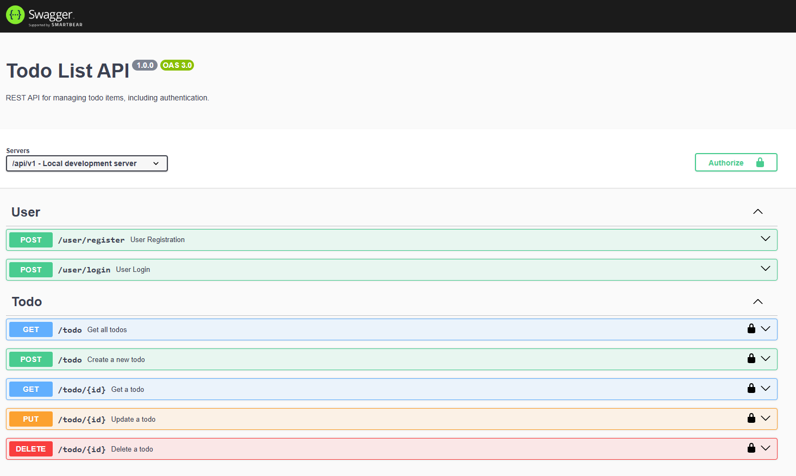

# Todo Application

This is REST application written in typescript using nodejs. Also, I have added swagger documentation for an easy use.

Note: This project is build on node version 18.20.5

## Setps for starting Todo App locally

- clone project in local environment
- setup .env file for following parameters to setup environment variable
    - PORT=XXXX (application port)
    - DB_HOST=XXXX (database host)
    - DB_PORT=XXXX (database port)
    - DB_NAME=XXXX (database name)
    - DB_USER=XXXX (database username)
    - DB_PASS=XXXX (database password)
    - TOKEN_SECRET=XXXX (salt for token)
    - TODO_CRON=0 0 * * * (cron expression)
    - LOG_LEVEL=info (log level)

    Note: if this is not setup then default configuration would be taken from app.config.ts file
- Install necessary dependancy
    ```
    npm install
    ```
- Run build command to build project
    ```
    npm run build
    ``` 
- Start application using below command
    ```
    npm start
    ```
- After application is started use http://localhost:4040/api-docs/#/ (Note: use your port)

## Setps for starting Todo App through docker-compose

### Prerequisite

- Docker must be install in the system.
- 7101, 7102, 7103 ports must be available in host machine. (if you want to change it then you must edit docker compose file)
- I have added environment variable in docker compose file for a reference, for production it is not recommended to add it in Repo.

- Go to the root directory in project.
- Run bellow command and wait for some time, it will start all docker containers.
    ```
    docker-compose up -d
    ``` 
- Once everithing is up and running then use http://localhost:7103/api-docs/ for testing.

